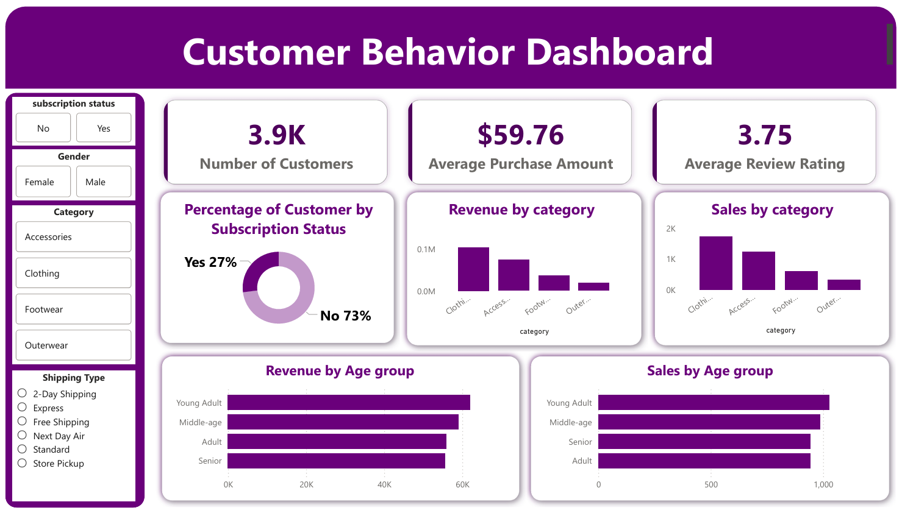

# Customer Shopping Behavior Analysis (Python + MySQL + Power BI Dashboard)

## Project Overview
This project analyzes customer shopping behavior data to uncover purchasing trends, customer segments, revenue distribution, and subscription impact.

## The workflow includes:

- Data Cleaning & Feature Engineering using Python
- Database Storage using MySQL
- Advanced SQL Analysis
- Interactive Dashboard Creation using Power BI
- This project simulates a real-world retail analytics pipeline.

## Project Architecture
CSV Dataset 

⬇

Python (Data Cleaning & Transformation)

⬇

MySQL Database (Structured Storage)

⬇

SQL Analysis

⬇

Power BI Dashboard

## Data Preparation (Python)
- Handled missing review ratings using median imputation
- Standardized column names
- Created age_group feature
- Converted purchase frequency into numeric days
- Removed redundant columns
- Uploaded cleaned data into MySQL

## SQL Analysis Performed
The following business questions were answered using SQL:

🔹 Revenue Analysis
- Total revenue by gender
- Revenue contribution by age group
- Subscriber vs non-subscriber revenue comparison
  
🔹 Customer Behavior Analysis
- Customers who used discounts but spent above average
- Repeat buyers vs subscription likelihood
- Customer segmentation (New, Returning, Loyal)
  
🔹 Product Performance Analysis
- Top 5 products by average review rating
- Top 3 most purchased products in each category
- Products with highest discount usage rate

🔹 Operational Analysis
- Average purchase comparison: Standard vs Express shipping

## Power BI Dashboard
An interactive dashboard was created using Power BI to visualize:
- Revenue by Category
- Sales by Category
- Revenue by Age Group
- Sales by Age Group
- Percentage of Customer by Subscription status
- The dashboard provides business-ready insights with dynamic filtering capabilities.

## Dashboard Screenshot

